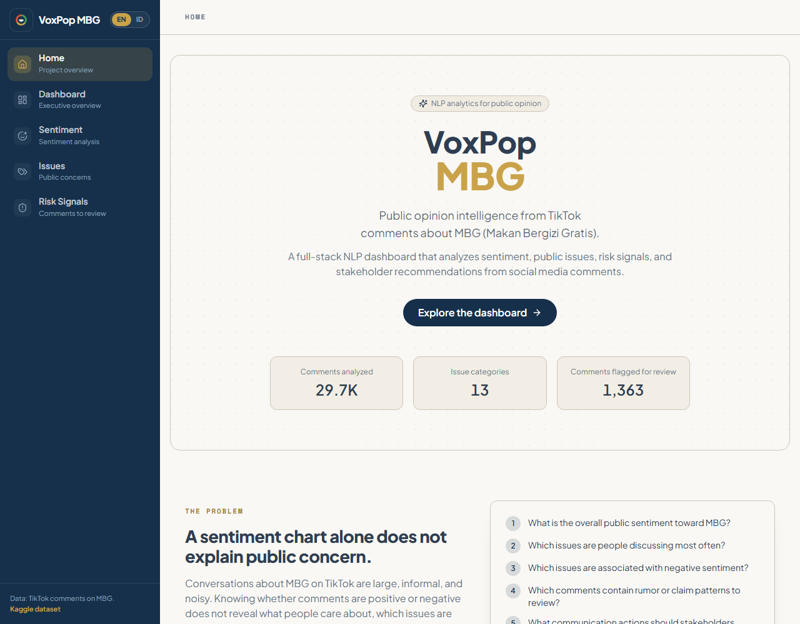

# VoxPop MBG

VoxPop MBG is a full-stack NLP dashboard that analyzes TikTok comments about Indonesia's Makan Bergizi Gratis (MBG) program. It converts unstructured comments into sentiment insights, public issue categories, risk signals, and an executive summary.

The project pairs a reproducible Python NLP pipeline with a Next.js dashboard. The pipeline exports static JSON, and the web app reads that JSON — no raw data or model server is required at runtime.



> Live demo: deploy to Vercel and set `NEXT_PUBLIC_APP_URL` (see [Deployment](#deployment)).

## Problem

Public conversations about MBG on TikTok are large, informal, and noisy. A sentiment chart alone shows whether comments are positive or negative, but not what people are concerned about, which issues are escalating, or which narratives need verification. VoxPop MBG turns the comments into a dashboard that answers:

1. What is the overall public sentiment toward MBG?
2. Which issues are people discussing most often?
3. Which issues are associated with negative sentiment?
4. Which comments contain rumor or claim patterns to review?
5. What communication actions should stakeholders prioritize?

## Features

- Sentiment analysis for Indonesian social media comments
- Issue detection across categories such as food quality, food safety, budget transparency, and distribution fairness
- Transparent risk-signal scoring for comments that may require manual review
- Executive summary derived from aggregated metrics
- Interactive single-comment analyzer that runs entirely in the browser
- Bilingual interface (English / Indonesian) and a responsive layout

## Tech stack

- Next.js (App Router), TypeScript, Tailwind CSS, Recharts, lucide-react
- Plus Jakarta Sans + Space Mono via `next/font`; bilingual (EN/ID) UI
- Python, scikit-learn, NumPy
- Static JSON as the data contract between pipeline and frontend

## Dataset

This project uses the Kaggle dataset "Dataset Komentar TikTok MBG (Makan Bergizi Gratis)" by SinRyuRifal.

Dataset link: https://www.kaggle.com/datasets/sinryurifal/dataset-komentar-tiktok-mbg-makan-bergizi-gratis

Raw dataset files are not included in this repository. Place downloaded files in `data/raw/` before running the pipeline.

## Methodology

The pipeline loads TikTok comment data, detects the schema, cleans and normalizes Indonesian text, applies sentiment classification, maps comments into issue categories, calculates risk signals, and exports frontend-ready JSON files.

- **Cleaning**: lowercasing, masking of URLs/mentions/emails/phone-like sequences, repeated-character and punctuation normalization, and a small informal-Indonesian dictionary. Negation words are preserved.
- **Deduplication**: rows that repeat the same identifier are collapsed, then exact duplicate comments are removed after normalization.
- **Sentiment**: lexicon-based weak labels train a TF-IDF + Logistic Regression classifier; the predicted probability is used as a confidence score. Reported metrics describe cross-validated agreement with the weak labels.
- **Issues**: a curated keyword taxonomy maps comments to stakeholder-friendly categories. Embedding-based discovery (BERTopic) is available as an optional extension.
- **Risk**: a transparent additive 0–100 score built from auditable lexical cues, bucketed into low, medium, high, and needs-verification.

Risk signals are indicators for manual review. They do not determine whether a comment is true or false.

## Architecture

```text
data/raw/            Raw dataset (git-ignored)
pipeline/            Python NLP pipeline
  src/voxpop_mbg/    Pipeline modules
  scripts/           inspect_dataset.py, run_pipeline.py, create_sample_data.py
  tests/             pytest suite
web/                 Next.js dashboard
  app/               Pages (home, dashboard, sentiment, issues, risk)
  components/        Layout, charts, tables, UI, demo
  lib/               Types, data loaders, formatting, constants
  public/data/       Exported JSON read by the dashboard
```

The pipeline writes seven JSON files to `web/public/data/`: `overview.json`, `sentiment_summary.json`, `issue_summary.json`, `risk_summary.json`, `comments_sample.json`, `recommendations.json`, and `model_metrics.json`.

## Local setup

### 1. Run the pipeline

```bash
cd pipeline
python -m venv .venv
source .venv/bin/activate        # Windows: .venv\Scripts\activate
pip install -r requirements.txt
python scripts/inspect_dataset.py --input ../data/raw
python scripts/run_pipeline.py --input ../data/raw --output ../web/public/data
```

If `data/raw/` contains more than one supported file, pass `--file <name>` to choose one. If the comment column cannot be detected automatically, pass `--comment-column <name>`.

No dataset yet? Generate placeholder data that matches the schema:

```bash
python scripts/create_sample_data.py --output ../web/public/data
```

### 2. Run the web app

```bash
cd web
npm install
npm run dev
```

Open http://localhost:3000.

### Build

```bash
cd web
npm run build
```

## Deployment

The dashboard is a Next.js app in the `web/` subdirectory and deploys to Vercel as a static-JSON site (no backend).

1. Push the repository to GitHub.
2. Import the project in Vercel and set the **Root Directory** to `web`.
3. (Optional) Add the environment variables from `web/.env.example`:
   - `NEXT_PUBLIC_APP_URL` — your production URL, used for page metadata.
   - `NEXT_PUBLIC_GITHUB_URL` — when set, the home page shows a "View on GitHub" button.
4. Deploy. Vercel runs `npm run build` automatically.

The sanitized `web/public/data/*.json` files are committed, so the dashboard works without the raw dataset. To refresh them, re-run the pipeline and redeploy.

## Output examples

`sentiment_summary.json` (excerpt):

```json
{
  "distribution": [
    { "label": "positive", "count": 4069, "share": 0.1368 },
    { "label": "negative", "count": 4374, "share": 0.147 }
  ],
  "average_confidence": 0.9,
  "method": "tfidf_logistic_regression_with_weak_labels"
}
```

`comments_sample.json` (excerpt):

```json
{
  "id": "c_000001",
  "text": "Takut makanannya tidak layak untuk anak sekolah.",
  "sentiment": "negative",
  "sentiment_confidence": 0.88,
  "issue_id": "food_quality",
  "issue_name": "Food Quality",
  "risk_score": 35,
  "risk_level": "medium",
  "risk_reasons": [
    { "type": "food_safety", "term": "basi", "en": "Contains food safety claim: basi", "id": "Memuat klaim keamanan pangan: basi" }
  ]
}
```

## Evaluation notes

The dataset does not ship with sentiment labels, so the pipeline uses weak labeling. Reported accuracy and macro F1 describe how well the TF-IDF model reproduces the weak labels under cross-validation, not agreement with human-reviewed annotations. Treat the numbers as a measure of internal consistency, not ground-truth accuracy.

## Limitations

- The dataset may not represent all TikTok users or the broader public.
- Sentiment and issue labels depend on weak labeling and a rule-based taxonomy rather than human-reviewed annotations.
- Risk scoring is a review aid, not a truth judgment.

## Ethical considerations

Risk signals in this project are designed for manual review support. They do not determine whether a comment is true or false. The dashboard avoids exposing usernames or personal identifiers and focuses on aggregated public discussion patterns. Comment excerpts are sanitized and truncated before they are exported.

## Future improvements

- Optional FastAPI inference service for the interactive analyzer
- IndoBERT fine-tuning if reliable labels become available
- A small human-reviewed validation set for stronger evaluation
- Embedding-based topic discovery with BERTopic
- Engagement-weighted sentiment using reply counts
